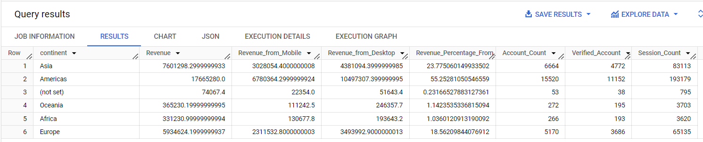

# Revenue by Device and Continent with Session Counts - SQL Task  

This repository contains a SQL script for analyzing revenue by device type and continent, with additional insights into account and session counts.

---

## Revenue by Device and Continent with Session Counts - SQL Task 

This SQL script calculates revenue generated by product sales, with a breakdown by device type (mobile and desktop), grouped by continent. It also provides additional insights into the number of accounts per continent (including verified accounts) and the number of sessions per continent.

### Description

In this task, we calculate the total revenue, revenue from mobile devices, and revenue from desktop devices, grouped by continent. The result includes:

- **continent**: The continent where the sales occurred.
- **Revenue**: The total revenue from all devices for that continent.
- **Revenue_from_Mobile**: The revenue generated from mobile devices for that continent.
- **Revenue_from_Desktop**: The revenue generated from desktop devices for that continent.
- **Revenue_Percentage_From_Total**: The percentage of total revenue contributed by the continent, relative to the global revenue.
- **Account_Count**: The number of unique accounts associated with the continent.
- **Verified_Account**: The number of verified accounts associated with the continent.
- **Session_Count**: The number of unique sessions associated with the continent.

### Output Example

### SQL Query Breakdown

1. **Revenue Calculation**:
   - Aggregates revenue by continent, calculating total revenue, revenue from mobile, and revenue from desktop.
   - Joins the `order`, `product`, and `session_params` tables to gather relevant data.

2. **Account Count Calculation**:
   - Counts the number of unique accounts per continent.
   - Also calculates the number of verified accounts by checking the `is_verified` field in the `account` table.

3. **Session Count Calculation**:
   - Counts the number of unique sessions per continent by aggregating the `ga_session_id` field in the `session_params` table.

4. **Final Result**:
   - Combines the results of the revenue, account count, and session count calculations.
   - Displays the continent, the revenue breakdown by device, account and session counts, and the percentage of total revenue from each continent.

---

This query helps you understand the revenue distribution by continent and device type, while also providing valuable insights into account and session activity for each continent.

### SQL File
You can find the SQL script for this task here: [Revenue_by_Device_and_Continent_with_Sessions.sql](./Revenue_by_Device_and_Continent_with_Sessions.sql)
