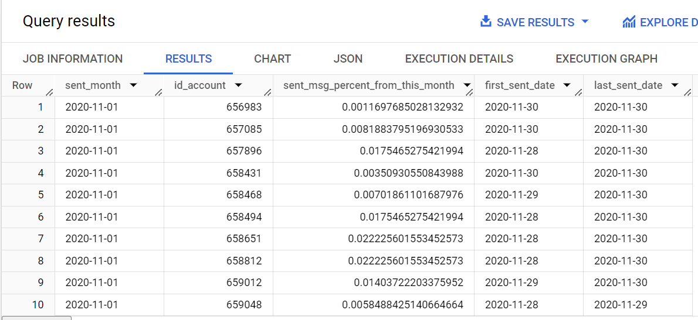

# Emails Sent by Month - SQL Task

This SQL script calculates the percentage of emails sent per account by month. It uses **window functions** to partition the data by month and computes the percentage of emails sent by each account relative to the total sent emails for that month.

## Description

In this task, we calculate the percentage of emails sent each month, with the result showing the percentage contribution of each account's emails to the total emails sent in that month. The query provides the following columns for each month:

- **sent_month**: The month when the emails were sent.
- **id_account**: The unique identifier of the account.
- **sent_msg_percent_from_this_month**: The percentage of emails sent by the account for that month, calculated relative to the total emails sent that month.
- **first_sent_date**: The date when the first email was sent by the account in that month.
- **last_sent_date**: The date when the last email was sent by the account in that month.

## Output Example

Here’s an example of the output generated by the SQL script:

## SQL Query Breakdown

1. **Monthly Data Calculation**:
   - Extracts the month and year from the `sent_date` of the emails.
   - Joins `email_sent`, `account_session`, and `session` tables to gather data related to each account and their sent messages.

2. **Percentage Calculation**:
   - Uses `COUNT(DISTINCT id_message)` to calculate the total messages sent by each account.
   - Calculates the percentage of messages sent by the account using the window function `SUM(COUNT(DISTINCT id_message)) OVER (PARTITION BY sent_month)`.

3. **Result Formatting**:
   - Displays the month, account ID, the percentage of emails sent by the account in that month, and the first and last sent dates.
